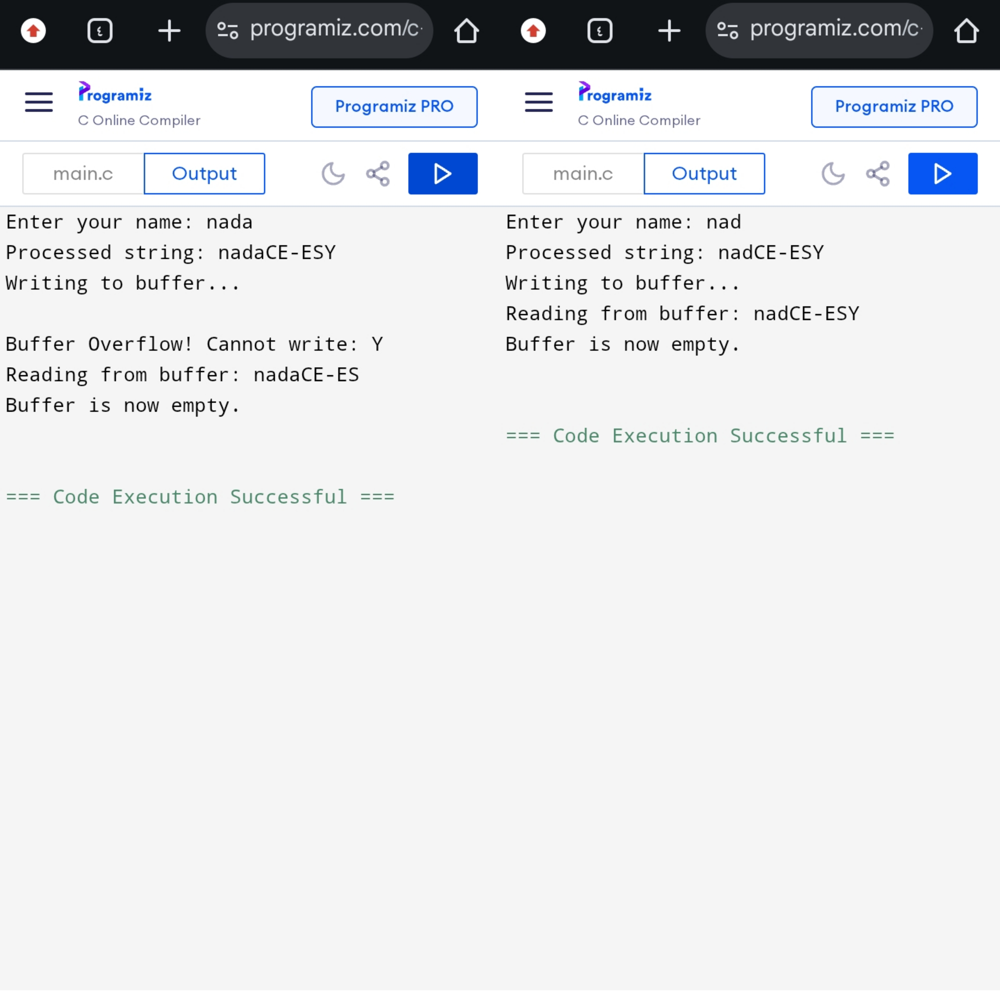

......الاسم : ندى حسن أبوزرار .....

1- تعريف الهيكل: 
buffer[size] المصفوفة التي تخزن البيانات 
head مؤشر القراءة 
tail مؤشر الكتابة 
count عداد لعدد العناصر في المخزن

2- تابع التهيئة init :
تصفير المؤشرات + العداد 

3- تابع التحقق اذا المخزن ممتلئ :
تقارن العداد count بالحجم الكلي size 
يعطي اشارة true اذا تساويا ولايمكن الكتابة فيه 

4- تابع التحقق اذا المخزن فارغ :
يعطي اشارة true اذا كان العداد count يساوي الصفر اي الخزان فارغ ولايوجد شيء لقراءته 

5- تابع الكتابة : 
استدعاء تابع التحقق انه ممتلئ للتأكد من انه غير ممتلئ لتجنب overflow 
نضع البيانات في المكان الذي يشير اليه المؤشر tail
 tail + 1 مع استخدام باقي القسمة للتأكد ام المؤشر وصل الى نهاية المصفوفة للعودة الى البداية 
count ++

6- تابع القراءة : 
استدعاء تابع التحقق من انه فارغ للتأكد انه ليس فارغ لتجنب  underflow 
نأخد البيانات مكان مايشير head 
تحريك المؤشر head الى الامام 
count -- 

7ـ التابع الرئيسي main : 
ـ انشاء غرض 
ـ استدعاء تابع التهيئة مع تمرير عنوان المخزن 
ـ مصفوفة الاسم مع اللاحقة 
ـ طباعة 
ـ ادخال الاسم من قبل المستخدم 
ـ التابع strcat لدمج السلاسل المحرفية (الاسم مع اللاحقة)
ـ طباعة النتيجة
-حلقة التكرار للمرور على حرف حرف واستدعاء تابع الكتابة لنأخذ حرف حرف ونضعه في المخزن حتى ينتهي الاسم او يمتلئ المخزن   
- وضعنا شرط طالما المخزن ليس فارغ نتابع العمل 
- استدعاء تابع القراءة لنسحب حرف حرف من المخزن في كل مرة 
- طباعة الاسم كاملاً 
- شرط للتأكد من انه المخزن اصبح فارغ تماماً بعد الانتهاء

